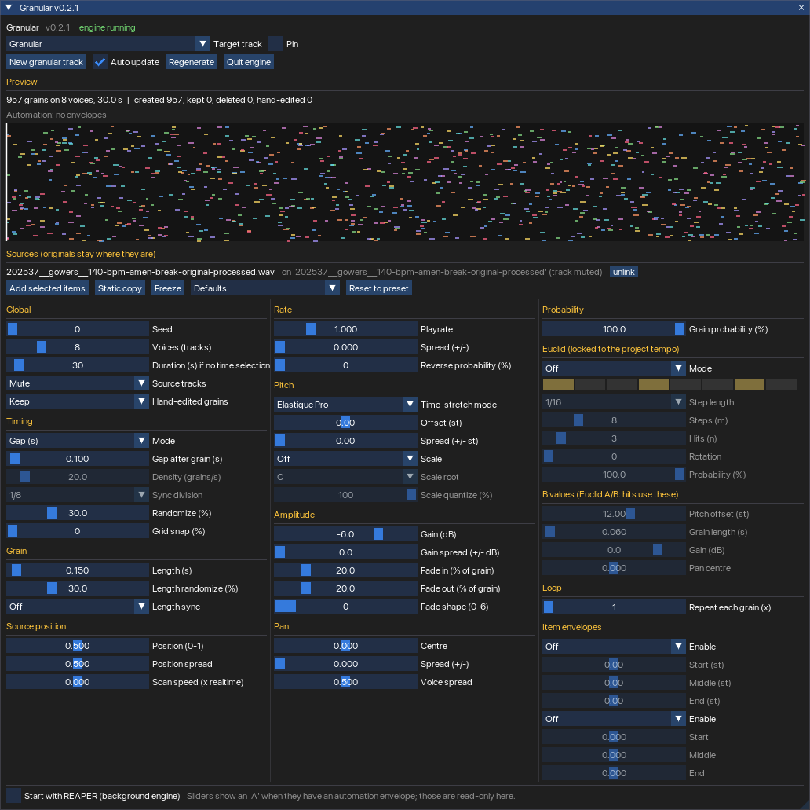

# Granular v0.2.1 – granular synthesis-driven REAPER project generator



Pick audio items → get a cloud of grain items on voice tracks that **follows your sliders and automation**.
Port and expansion of the original `core.py` generator. One action (`Granular.lua`) does everything.

## Quick start (macOS)

```bash
cd Granular-0.2.1
./install_mac.sh              # add --autostart to start the engine with REAPER
```

Then in REAPER: *Actions → Show action list → search "Granular" → run **Script: Granular.lua***
(If REAPER was open during install, the script is not registered yet – use *New action → Load ReaScript…*
and pick `~/Library/Application Support/REAPER/Scripts/Granular/Granular.lua`, or re-run the installer with REAPER closed.)

The window needs **ReaImGui** (*Extensions → ReaPack → Browse packages → "ReaImGui"*). Without it the engine still runs
headless, but there is no window.

Manual install: copy `Granular.lua` anywhere, load it as a ReaScript. The JSFX installs itself on first run.
Windows/Linux: same, or `install_mac.sh --portable <REAPER folder>` for portable installs.
Uninstall: `./install_mac.sh --uninstall` removes exactly what it added (your projects are never touched).

## Using it

1. Select one or more **audio items** (they stay exactly where they are) and press **New granular track**
   – or press it with nothing selected and pick a file.
2. A folder track "Granular" (carries the JSFX) with voice tracks appears; the **original item's track is muted**
   (and un-muted again if you unlink or freeze).
3. Move sliders in the window (or the JSFX, or draw automation). After ~0.3 s only the grains that changed are rewritten.
   One undo step per update.

| Window element | What it does |
|---|---|
| Header | Version, engine state, target track (follows the selected track, or **Pin** it), Auto update / Regenerate |
| **Preview** (top) | Grains as time (x) vs. source position (y), one colour per voice, **white = Euclid B grains**, playhead |
| Sources | Linked items with their track; **unlink**; **Add selected items** |
| **Static copy** | Copies the current cloud as plain items in a new folder; the live cloud stays |
| **Freeze** | Cloud becomes plain items; JSFX and links removed; muted original un-muted |
| **Reset to preset** | Dropdown + button: *Defaults*, *Original core.py (start)*, *Texture cloud*, *Euclid rhythm*. Seed, Update, Source mute and Hand-edited-grains are kept; envelopes are not touched |
| Three columns | **1 when & where:** Global, Timing, Grain, Source position · **2 sound:** Rate, Pitch, Amplitude, Pan · **3 pattern & shaping:** Probability, Euclid, B values, Loop, item envelopes |
| **A** badge | The slider has an automation envelope. It is read-only in the window; edit the envelope in the lane |
| Start with REAPER | Adds/removes a marked block in `Scripts/__startup.lua` |

Right-click a slider: reset / create automation envelope. Double-click: reset.

Generation range: the time selection if there is one, otherwise from the earliest source item for *Duration* seconds.
Automatable: everything except Seed, Voices, Duration (read once per update).

### Euclid (new in 0.2.1)
A grain's position in quarter notes, divided by the **step length**, gives its step in an `n` hits / `m` steps pattern
(rotatable). Because it is computed from the project's tempo map, the pattern stays on the bar grid and follows tempo changes.
The little strip in the window shows the pattern (and the playing step). With **Timing = Beats sync**, **Step length = Sync division**
and **Grid snap 100%**, every grain sits exactly on a step.

| Mode | Effect |
|---|---|
| Off | No Euclid. |
| **Gate** | Only grains that land on a hit step are played (and pass *Euclid probability*). The normal *Grain probability* still applies on top. |
| **A/B switch** | Every grain plays; on a hit step (passing *Euclid probability*) it uses the **B** values instead of the normal ones: **pitch, grain length, gain, pan centre**. Spreads/randomisation still apply. B length is ignored while *Grain length sync* is on. |

Steps, hits, rotation, step length, probability and every B value are automatable.

### Loop (new in 0.2.1)
*Repeat each grain (x)* (1–16, automatable) writes each grain N times, back to back, as separate items (so each repeat has its own
fades and can be edited). In *Gap* timing mode the next grain starts after all repeats plus the gap; in Density / Beats mode the clock
is unchanged, so repeats may overlap the next grain. (REAPER's own "loop source" repeats the whole source rather than a grain, so it was not used.)

### Timing, scan, scale
- **Timing mode**: *Gap* (original: next grain = item length + gap), *Density* (grains/s), *Beats sync* (tempo-map aware).
  **Grid snap** pulls grain starts onto the sync grid; **Grain length sync** sets length in note values.
- **Source position / spread / scan speed**: draw the position as an envelope for a scan path; wraps at the ends.
- **Reverse %**, **Scale + root + quantize %**, pitch/pan envelopes per grain (3 points, as in the original).
- **Hand-edited grains** (moved, resized, locked) are kept unless set to *Overwrite*.

### Automation
The engine **reads the parameter envelopes** (`Envelope_Evaluate`) and evaluates them at each grain's position. It does
not need playback. It works out on its own whether REAPER hands it normalised (0–1) or real slider units (shown under the
preview as "read as … (points|live|assumed)").
**Not seen:** parameter modulation (LFO, audio control signal, MIDI link) and automation *items* – press
Regenerate after editing automation items.

## Verified vs. NOT verified

Verified offline (`tools/run_tests.sh`, 215 checks; any Lua 5.3+): the core (RNG, timing, scale, bounds, determinism,
append-only slider order), and against an in-memory fake of the REAPER API: source links incl. moved/deleted items,
the mute lifecycle, folder handling, diffing, envelope-unit detection, JSFX self-install, create/freeze/static copy, the
whole engine loop, the UI code with stubbed ImGui (clicks, slider writes), the built bundle's real main loop
(headless, windowed, toggle, autostart), and the installer (idempotent, uninstall, spaces in paths).

**Not run inside REAPER – I could not.** Check in this order:
0. **New in 0.2.1**: Euclid Gate / A-B on a tempo other than 120 (the tests use a fake tempo map), a tempo *change* mid-project
   (the change should re-generate), Loop with reversed grains (reverse is applied per repeat item), and the 3-column layout at your
   window width. If you open a v0.2.0 project, its JSFX instance has 45 sliders: the window shows a red "JSFX is older" line – remove the
   FX and add "Granular Generator (control)" again (or restart REAPER); slider order is unchanged so your values and automation carry over.
1. **Everything from v0.1 still applies**: reversed grains play backwards from the right place (action 41051); item
   pitch/pan envelopes appear (spliced into the item chunk); time-stretch mode numbers.
2. **JSFX self-install**: right after the first run, "New granular track" must find `JS:Granular/GranularGen`.
   If REAPER wants to rescan first, restart it once. The JSFX window should show "engine running".
3. **Envelope units**: draw an envelope on *Grain: Length*; the preview line should say "read as normalised/real …".
4. **ReaImGui calls** not used in `Spike_Leveler.lua`: `Spacing, SetNextItemWidth, IsItemHovered, IsMouseDoubleClicked,
   BeginPopupContextItem/MenuItem/EndPopup, SmallButton, PushID/PopID`. If the window shows a red error line, send it to me.
5. **`reaper-kb.ini` line format** written by the installer (`SCR 4 0 RS<sha1> …`), and **autostart** via `__startup.lua`.
6. Sliders dragged in the window do not send "touch" events, so touch/latch automation recording from the window is
   imperfect (write mode is fine; the JSFX's own sliders behave normally).

## Upgrading from v0.2.0
Drop-in: same action, same slider order (11 sliders appended). Projects made with 0.2.0 regenerate to identical grains
(checked: 2147 grains over four configurations, byte-identical hashes) as long as Euclid and Loop are off.
The old "Original core.py preset" button is now the *Reset to preset* dropdown.

## Upgrading from v0.1
Old scripts (`Granular_Engine.lua`, …) are replaced by `Granular.lua`. Slider order is unchanged, so v0.1 projects and
their automation keep working; items lying on the granular track still count as sources. *Global: Source* now mutes the
original's **track** for linked items (items on the granular track itself are muted as before).
Slider order is **append-only** from now on.

## Changes vs. v0.1
Version display · ReaImGui window · originals stay in place (GUID links, follow moves) · track mute with exact restore ·
one action, self-installing JSFX, engine + window in one loop · envelope unit auto-detect · "Regenerate" no longer
triggers a second update · Freeze / Static copy · preview · autostart · Mac installer.
Removed: the JSFX-side capture idea (dropped by agreement – envelopes are read directly).

## Developing
```
src/     modules (edit these)        tools/run_tests.sh   build + all tests
tools/   build.lua, tests, mock      dist/Granular.lua    generated bundle (never edit)
```
`lua tools/build.lua` bundles `src/*.lua` into one `Granular.lua`, stamps `Core.VERSION` and regenerates the JSFX.

## Roadmap
0.3: presets on disk (save/load), per-parameter re-roll/lock, sources shared between granular tracks, `.rpp` writer if still wanted.
